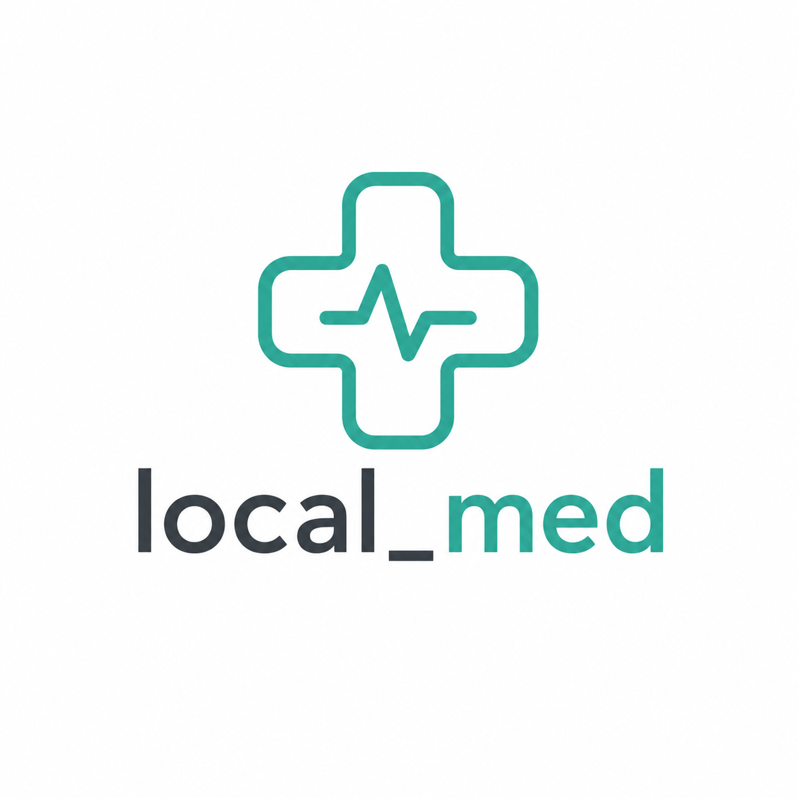

<p align="center">
  
</p>

# local-med

App móvil de primeros auxilios con IA completamente offline. Corre un LLM directamente en el dispositivo — sin servidores, sin internet, sin latencia de red. Diseñada para zonas con conectividad limitada en LATAM.

## Arquitectura

La app responde en tres capas:

| Capa | Mecanismo | Cuándo actúa |
|------|-----------|--------------|
| 1 — Crítica | Código Dart hardcodeado, sin IA | RCP, Heimlich, hemorragia severa, posición de recuperación |
| 2 — Conversacional | Gemma 4 E2B (GGUF Q4_K_M) on-device | Síntomas y consultas de segundo nivel |
| 3 — RAG local | SQLite + FTS5 + embeddings vectoriales | Consultas complejas, fallback por baja confianza |

Los protocolos de la capa 1 están hardcodeados para eliminar el riesgo de alucinaciones en emergencias.

## Stack

| Componente | Tecnología |
|------------|------------|
| App móvil | Flutter |
| LLM on-device | Gemma 4 E2B · GGUF Q4_K_M · llama.cpp |
| Embeddings | `paraphrase-multilingual-MiniLM-L12-v2` (ONNX, ~117 MB) |
| Base de datos | SQLite + FTS5 |
| Fine-tuning | QLoRA + Unsloth · Google Colab T4 |

## Descarga inicial (~1.45 GB por WiFi)

| Componente | Tamaño |
|------------|--------|
| Gemma 4 E2B (GGUF Q4_K_M) | ~1.3 GB |
| Modelo de embeddings | ~117 MB |
| Protocolos + vectores | ~15–20 MB |

## Desarrollo

```bash
cd local_med
flutter pub get
flutter run
```

Ver [`docs/`](docs/) para arquitectura completa, pipeline de datos y referencia de API.

## Roadmap

- [ ] Curar dataset médico (AHA, Cruz Roja, PHTLS) en español
- [ ] Fine-tuning en Colab con dataset real
- [ ] Evaluar modelo fine-tuneado vs base
- [ ] Integrar GGUF en app móvil y medir velocidad en dispositivo real
- [ ] Definir estrategia de actualización de protocolos
- [ ] Marco legal: COFEPRIS (México), ARCSA (Ecuador), FDA (EEUU)
